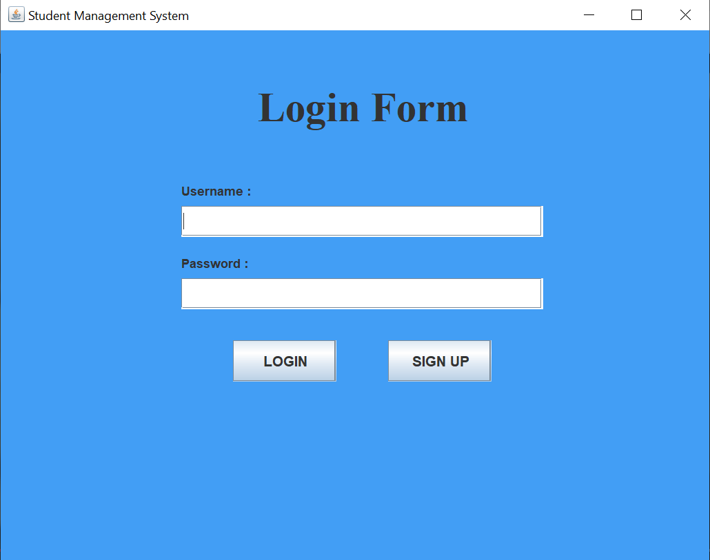
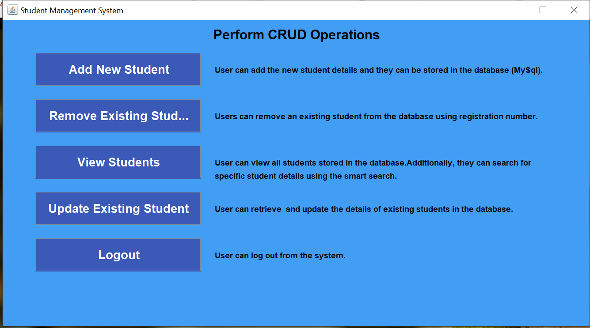
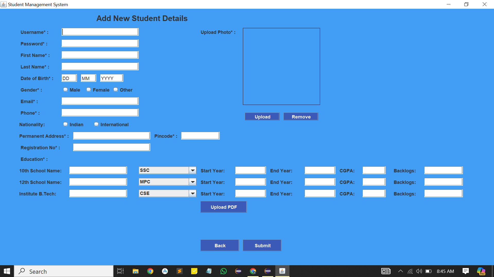
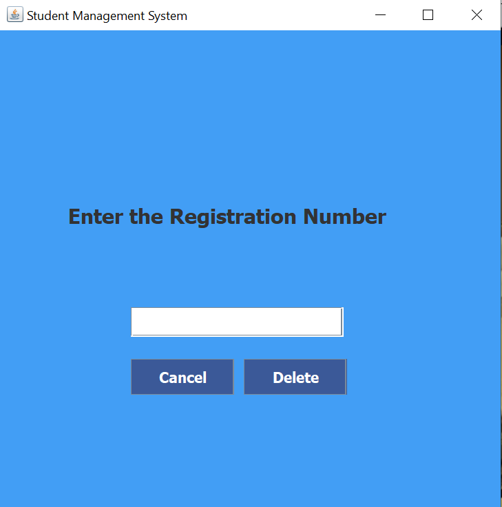
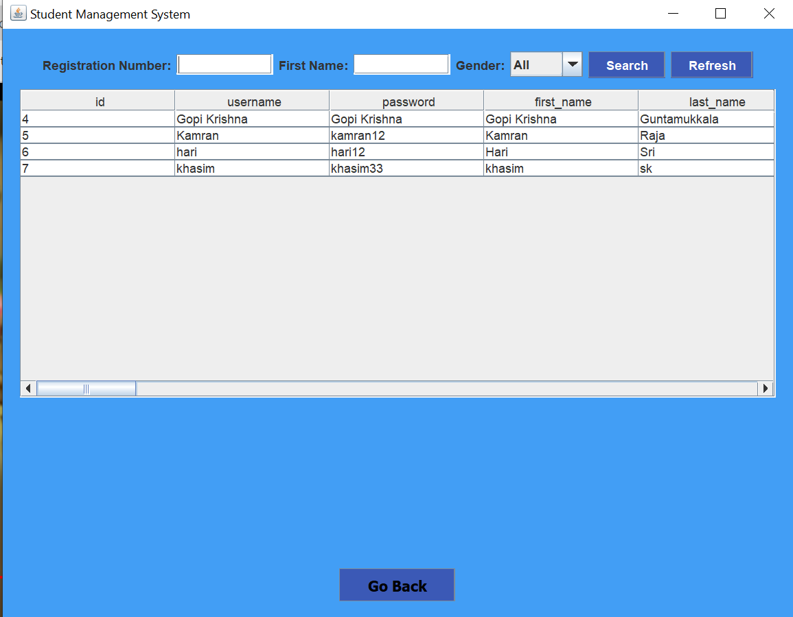
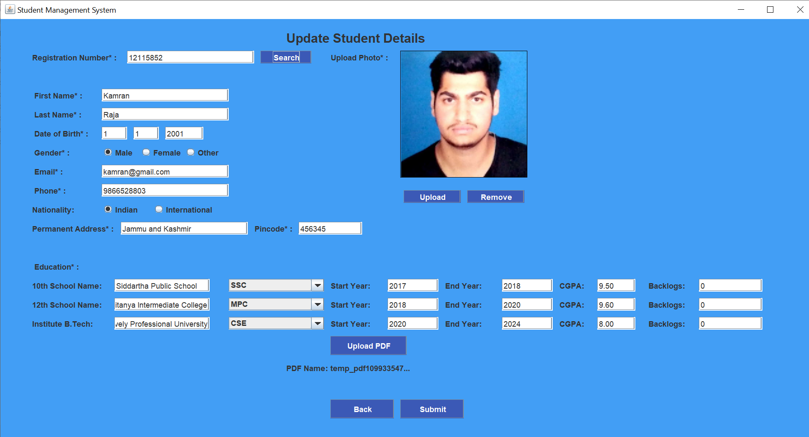
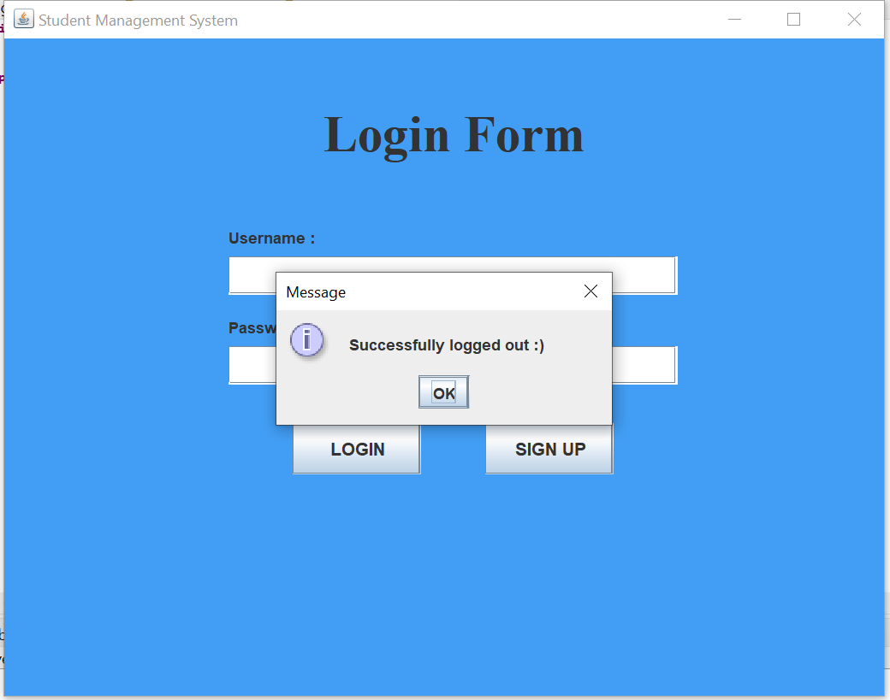

# Student Management System Using Java

## Mini Project (Associated with Advanced Java Programming Subject [CSE406] at Lovely Professional University)

This repository contains the source code and documentation for the Student Management System project, which was developed as a part of the Advanced Java Programming course (CSE406) at Lovely Professional University.

### Project Overview

The Student Management System project aims to develop an intuitive application for managing student details using Java and the Swing GUI toolkit. Key features of the project include:

- **Intuitive User Interface**: Developed a user-friendly interface using Java and Swing GUI toolkit, allowing seamless interaction for users to input student details, including images and resumes.

- **Comprehensive Management Functionalities**: The system enables efficient registration, search, update, and deletion functionalities for managing student profiles. It offers a clear overview of all registered students, facilitating streamlined administrative tasks.

### Tech Stack

The project utilizes the following technologies:

- **Java**: Programming language used for backend development and application logic.
- **Swing GUI Toolkit**: Java library for creating graphical user interfaces.
- **MySQL Database**: Database management system for storing and managing student data.

### Versions
- Java_JDKVersion : java version "21.0.1"
- Editor       : Eclipse IDE for Java Developers - 2023-12
- MySQL Version: 5.5 ( i have used very old version becuase some another python programs are required. you can use anything.)
- Sqlconnector : 8.3.0 version

### Project Images

### Note
- connect the java + mysql + JDBC
- then use commands to create a database and create a table. (information mentioned in notepad file >> sql)
- then run the loginActivity.java file

